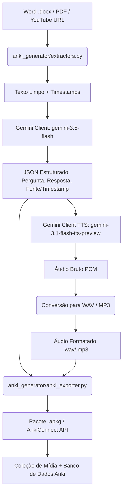

# Product Requirement Document (PRD) - Pipeline de Geração de Cartões Anki

Este documento define os requisitos técnicos, arquitetura de arquivos, dependências externas e fluxo de dados para a implementação da pipeline em Python que gera cartões de estudo para o Anki a partir de documentos Word, PDFs e vídeos do YouTube usando a API do Gemini.

---

## 1. Arquitetura do Codebase

A estrutura modular do pacote Python `anki_generator` foi desenhada para separar as responsabilidades de extração de conteúdo, chamada de APIs de IA, e montagem do pacote final do Anki:

*   `requirements.txt`: Especifica as dependências e versões exatas das bibliotecas Python para reprodutibilidade.
*   `.env.example`: Modelo de configuração para variáveis de ambiente, ocultando credenciais de API.
*   `main.py`: Ponto de entrada do script para execução unificada da pipeline.
*   `anki_generator/__init__.py`: Inicializador do pacote Python `anki_generator`.
*   `anki_generator/config.py`: Armazena constantes globais, definições de modelos Gemini e lógica de validação de ambiente.
*   `anki_generator/extractors.py`: Implementa a lógica de ingestão e limpeza de dados para `.docx`, `.pdf` e transcrição com timestamps do YouTube.
*   `anki_generator/gemini_client.py`: Gerencia a integração com o SDK `google-genai` para geração estruturada dos cartões e síntese de voz (TTS).
*   `anki_generator/anki_exporter.py`: Constrói a coleção de cartões, gerencia os arquivos de mídia associados e exporta via `genanki` ou `AnkiConnect`.
*   `anki_generator/cli.py`: Define a interface de linha de comando (CLI) para interação com o usuário.

---

## 2. Diagrama de Fluxo de Dados

A representação abaixo detalha o caminho do dado bruto até a integração no banco de dados local do Anki:



---

## 3. Documentação Externa Crucial

| Componente | Detalhe Técnico | URL de Origem | Data de Acesso |
| :--- | :--- | :--- | :--- |
| **Anki Connect** | Endpoints de integração local via HTTP (porta `8765`), usando ações `storeMediaFile` e `addNote`. | [AnkiConnect documentation](https://foosoft.net/projects/anki-connect/) | 2026-06-23 |
| **Anki Media** | Formato de referência a arquivos de som em campos do Anki: `[sound:nome_arquivo.mp3]`. | [Anki Desktop Manual](https://docs.ankiweb.net/media.html) | 2026-06-23 |
| **genanki** | Empacotamento offline de notas e arquivos binários em coleções de formato `.apkg`. | [genanki GitHub Repository](https://github.com/kerrickstaley/genanki) | 2026-06-23 |
| **YouTube Transcript** | Obtenção de segmentos de vídeo com campo `start` em segundos (float) e campo `text`. | [youtube-transcript-api GitHub](https://github.com/jdepoix/youtube-transcript-api) | 2026-06-23 |
| **google-genai SDK** | Nova biblioteca oficial para interação com a API Gemini utilizando `Client`. | [Gemini API Python Quickstart](https://ai.google.dev/gemini-api/docs/quickstart) | 2026-06-23 |
| **Gemini Structured Output** | Utilização de schemas Pydantic passados em `response_schema` com `response_mime_type="application/json"`. | [Gemini Structured Outputs Guide](https://ai.google.dev/gemini-api/docs/structured-output) | 2026-06-23 |
| **Gemini Speech Modality** | Utilização do modelo `gemini-3.1-flash-tts-preview` configurando `response_modalities=["AUDIO"]`. | [Gemini Audio Generation Guide](https://ai.google.dev/gemini-api/docs/speech-generation) | 2026-06-23 |

---

## 4. Padrões de Código e Snippets de Referência

### A. Geração Estruturada com `google-genai` e Pydantic v2

```python
from google import genai
from pydantic import BaseModel, Field
import os

class Flashcard(BaseModel):
    question: str = Field(description="A pergunta a ser feita no anverso do cartão.")
    answer_text: str = Field(description="A resposta em formato de texto para o verso do cartão.")
    source_reference: str = Field(description="Referência de onde a informação foi extraída (Ex: URL com timestamp).")

class FlashcardCollection(BaseModel):
    cards: list[Flashcard]

client = genai.Client(api_key=os.environ["GEMINI_API_KEY"])

response = client.models.generate_content(
    model="gemini-3.5-flash",
    contents="Gere cartões de estudo com base no texto: ...",
    config={
        "response_mime_type": "application/json",
        "response_schema": FlashcardCollection,
    }
)

# Acesso direto aos dados validados pelo Pydantic
flashcards: FlashcardCollection = response.parsed
```

### B. Síntese de Voz (TTS) com Gemini

```python
from google import genai
from google.genai import types
import wave
import os

client = genai.Client(api_key=os.environ["GEMINI_API_KEY"])

response = client.models.generate_content(
    model="gemini-3.1-flash-tts-preview",
    contents="Esta é a resposta de teste para geração de áudio.",
    config=types.GenerateContentConfig(
        response_modalities=["AUDIO"],
        speech_config=types.SpeechConfig(
            voice_config=types.VoiceConfig(
                prebuilt_voice_config=types.PrebuiltVoiceConfig(
                    voice_name="Kore"
                )
            )
        )
    )
)

# O retorno binário padrão do Gemini é áudio PCM bruto (16-bit, 24kHz, 1 canal)
raw_pcm_data = response.candidates[0].content.parts[0].inline_data.data

# Conversão para WAV estruturado
def convert_pcm_to_wav(output_filepath, pcm_data, channels=1, rate=24000, sample_width=2):
    with wave.open(output_filepath, "wb") as wav_file:
        wav_file.setnchannels(channels)
        wav_file.setsampwidth(sample_width)
        wav_file.setframerate(rate)
        wav_file.writeframes(pcm_data)

convert_pcm_to_wav("audio_resposta.wav", raw_pcm_data)
```

### C. Integração com Anki: genanki (Offline)

```python
import genanki
import os

# Definição do ID do modelo e do baralho (IDs únicos aleatórios de 10 dígitos)
MODEL_ID = 1432958472
DECK_ID = 1892847291

anki_model = genanki.Model(
    MODEL_ID,
    'Modelo Flashcard com Audio',
    fields=[
        {'name': 'Question'},
        {'name': 'AnswerText'},
        {'name': 'Audio'},
        {'name': 'Source'},
    ],
    templates=[
        {
            'name': 'Cartão 1',
            'qfmt': '{{Question}}',
            'afmt': '{{FrontSide}}<hr id="answer">{{AnswerText}}<br><br>{{Audio}}<br><br><small>Fonte: {{Source}}</small>',
        },
    ]
)

# A referência de áudio deve seguir o formato [sound:nome_do_arquivo.wav]
note = genanki.Note(
    model=anki_model,
    fields=[
        "Qual é a fórmula da água?",
        "H2O",
        "[sound:audio_h2o.wav]",
        "Documento de Química"
    ]
)

deck = genanki.Deck(DECK_ID, "Estudos Automatizados")
deck.add_note(note)

package = genanki.Package(deck)
# O caminho do arquivo físico local deve ser mapeado na lista media_files
package.media_files = ["caminho/do/arquivo/audio_h2o.wav"]
package.write_to_file("colecao_estudos.apkg")
```

### D. Integração com Anki: AnkiConnect (Online via HTTP)

```python
import json
import base64
import requests

def invoke_anki_connect(action, **params):
    payload = {"action": action, "version": 6, "params": params}
    response = requests.post("http://localhost:8765", json=payload).json()
    if response.get("error"):
        raise Exception(f"Erro no AnkiConnect: {response['error']}")
    return response["result"]

# 1. Enviar mídia para o diretório de mídias do Anki
filename = "audio_h2o.wav"
with open("caminho/do/arquivo/audio_h2o.wav", "rb") as f:
    base64_data = base64.b64encode(f.read()).decode("utf-8")

invoke_anki_connect("storeMediaFile", filename=filename, data=base64_data)

# 2. Criar a nota referenciando o arquivo de mídia
invoke_anki_connect("addNote", note={
    "deckName": "Estudos Automatizados",
    "modelName": "Basic",
    "fields": {
        "Front": "Qual é a fórmula da água?",
        "Back": f"H2O<br>[sound:{filename}]"
    },
    "options": {"allowDuplicate": False}
})
```

---

## 5. Gotchas e Decisões de Projeto

### A. Limites de Taxa (Rate Limits) e Custos
*   O modelo `gemini-3.5-flash` tem limites de rate limit mais tolerantes do que os modelos experimentais, mas requisições simultâneas em pipelines de grande volume podem disparar erros `429` (Too Many Requests). A pipeline deve conter lógica de recuo exponencial (`exponential backoff`) na camada de chamadas de API.

### B. Separação de Modelos e TTS
*   A síntese de voz **não pode** ser invocada sob o mesmo modelo de texto `gemini-3.5-flash`. A síntese de voz (TTS) exige a inicialização e envio de requisição ao modelo dedicado `gemini-3.1-flash-tts-preview`.

### C. Abordagem de Integração com Anki: genanki vs. AnkiConnect
Decidiu-se suportar ambas as modalidades sob controle de parâmetros na CLI:
*   **genanki (Padrão/Offline):** Gera um pacote portátil `.apkg`.
    *   *Pró:* Não exige que o Anki esteja rodando, sendo compatível com ambientes headless ou servidores CI.
    *   *Contra:* Requer interação manual do usuário para abrir e importar o arquivo `.apkg` gerado.
*   **AnkiConnect (Opcional/Online):** Grava diretamente na coleção do Anki via HTTP local.
    *   *Pró:* Automatização total e direta sem passos manuais.
    *   *Contra:* Exige que o Anki Desktop esteja ativo localmente e configurado com a extensão do AnkiConnect instalada.

### D. Montagem de Timestamps do YouTube
*   O extrator deve receber a URL do vídeo do YouTube, extrair o ID do vídeo usando expressões regulares estruturadas e obter a transcrição em blocos via `youtube-transcript-api`.
*   Para cada segmento de texto enviado ao Gemini, o extrator deve associar o tempo inicial em segundos (`start`), arredondando para inteiro (`int(start)`), e montar o parâmetro `&t=NNNs` anexado à URL base do vídeo.
*   **Risco Técnico:** Vídeos sem legenda ativada ou gerada automaticamente pelo YouTube retornarão falha na API. A pipeline deve capturar esta exceção e retornar um aviso claro ao usuário antes de abortar o processo.

### E. Processamento de Arquivos Multimodais (PDFs)
*   Para PDFs, o envio direto como documento multimodal para a API do Gemini é mais robusto em termos de manutenção do layout e tratamento de tabelas. Contudo, consome muito mais tokens de contexto em comparação ao texto bruto extraído com o `pypdf` localmente.
*   A pipeline usará o extrator local `pypdf` para leitura padrão de texto devido à eficiência de custo e velocidade, mas manterá suporte para envio de documento multimodal via Files API do Gemini como fallback.

### F. Formato de Áudio
*   O retorno binário do modelo `gemini-3.1-flash-tts-preview` é PCM bruto de 24kHz. Embora o Anki ofereça maior compatibilidade com arquivos de tamanho reduzido como `.mp3`, a biblioteca padrão do Python (`wave`) permite criar arquivos estruturados `.wav` diretamente sem necessidade de instalar binários externos do `ffmpeg` no sistema operacional do usuário. A pipeline padrão irá gerar arquivos `.wav` gerados via `wave`, permitindo o uso imediato sem dependências adicionais de sistema.
